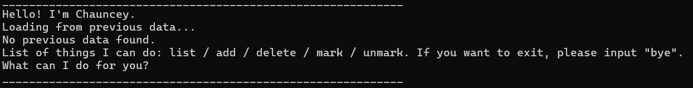

# Chauncey User Guide

## Product screenshot：



## Product intro：

Chauncey is a chatbot to help you keep track of your task list. Chauncey supports these operation:
1. List all the tasks currently in your task list with task type (to be introduced later), task status and task description.
2. Add task to your task list.
3. Delete a task from your task list.
4. Mark a task as done.
5. Unmark a task as not done.

Task type in Chauncey:
1. Todo (T): tasks that have no time limit
2. Deadline (D): tasks with a deadline
3. Event (E): tasks that need to be done within a time range

## Explanation of operations in Chauncey

### List the tasks

Action: type `list` when Chauncey ask for next command.

Outcome: all the tasks will be listed with the task details.

Example output:
```
Here are the tasks in your list:
1.[T][ ] borrow book
2.[T][ ] read book
3.[D][ ] submit assignment (by Sunday)
4.[E][ ] attend cs2113 lecture (from Friday 4pm to 6pm)
```

### Add a task

Action: 

1. type `add` when Chauncey ask for next command
2. Chauncey will ask for task type, input `todo` or `deadline` or `event`
3. Chauncey will ask for task details:
    1. if task type is "todo": input task description only
   2. if task type is "deadline", input task description and deadline, separated by "/". Example: `submit assignment/by Sunday`
   3. if task type is "event": input task description, task start time and end time, separated by "/". Example: `attend cs2113 lecture/from Friday 4pm/to 6pm`

Outcome: 

A new task will be added to the task list in Chauncey. 

Example of adding a task:
```
add // your input for step 1
____________________________________________________________
What type of task do you want to add? todo/deadline/event?event // step 2
Please enter the task details (split details by '/'):
attend cs2113 lecture/from Friday 4pm/to 6pm // step 3
Got it. I've added this task:
[E][ ] attend cs2113 lecture (from Friday 4pm to 6pm)
Now you have 4 tasks in the list.
____________________________________________________________
```

### Delete a task

Action: type `delete <taskNumber>` when Chauncey ask for next command. You can refer to the task number using `list` command (task number starts with 1).

Outcome: The specified task will be deleted in task list.

Example of deleting a task:
```
delete 1 // your input command
____________________________________________________________
Noted. I've removed this task:
[T][ ] borrow book
Now you have 3 tasks in the list.
____________________________________________________________
```

### Mark a task as done

Action: type `mark <taskNumber>` when Chauncey ask for next command. Again, you can refer to the task number using `list` command.

Outcome: the status of the specified task will be `done`.

Example of marking a task: 
```
mark 2 // Your input command
____________________________________________________________
Nice! I've marked this task as done:
[T][X] read book
____________________________________________________________
```

### Unmark a task

Action: type `unmark <taskNumber>` when Chauncey ask for next command. Again, you can refer to the task number using `list` command.

Outcome: the status of the specified task will be `undone`.

Example of unmarking a task:
```
unmark 1 // Your input command
____________________________________________________________
OK, I've marked this task as not done yet:
[T][ ] borrow book
____________________________________________________________
```

## Feature ABC

// Feature details


## Feature XYZ

// Feature details